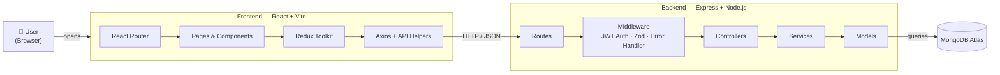
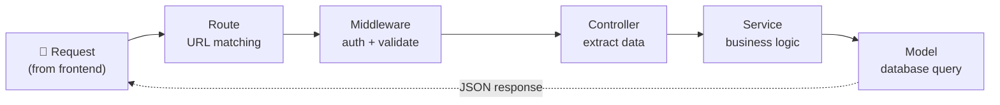
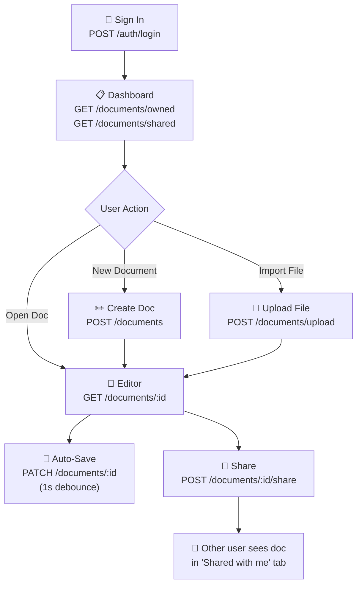
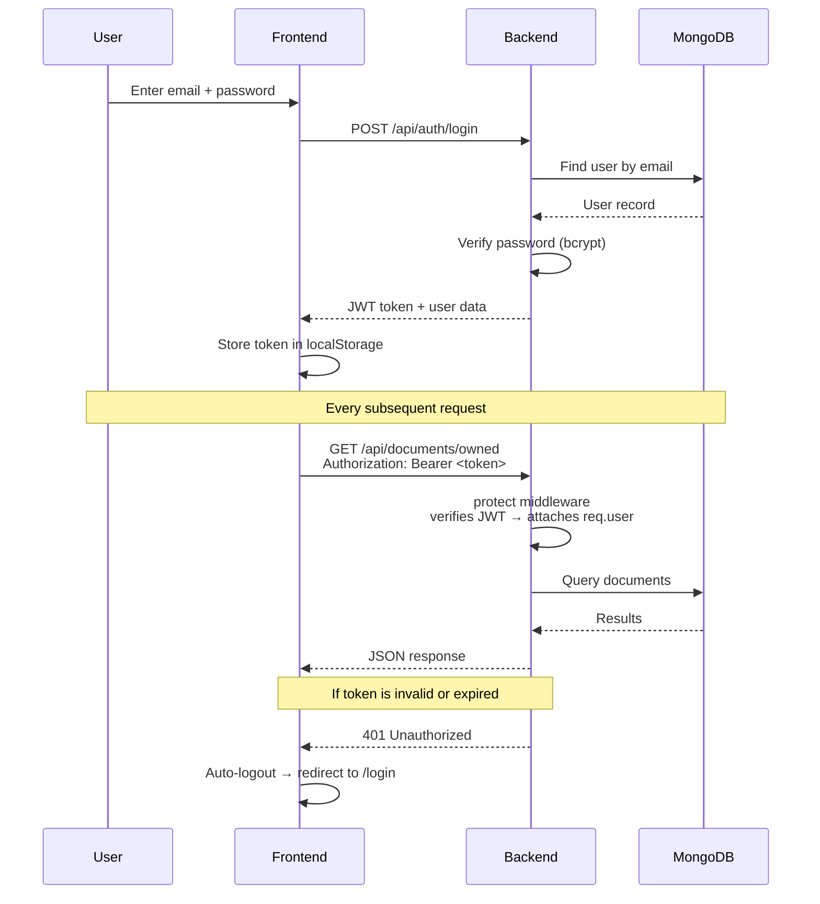
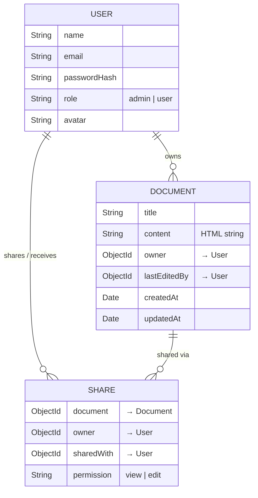

# Architecture Note — DocFlow

## Overview

DocFlow is a full-stack collaborative document editor built with a React frontend and Express backend, backed by MongoDB. The architecture prioritizes clear separation of concerns, testability, and fast iteration within a 4–6 hour timebox.

## System Architecture

## Request Flow

Every API request follows this pipeline from left to right:

## User Flow

## Authentication Flow

## Data Model

## Architecture Decisions

### 1. MVC + Service Layer (Backend)

The backend follows a layered architecture:

- **Routes** define endpoints and wire middleware (auth, validation).
- **Controllers** are thin — they extract request data and delegate to services.
- **Services** contain all business logic (access checks, data assembly, error throwing).
- **Models** define Mongoose schemas and instance methods.

**Why:** This separation keeps controllers testable and services reusable. Business rules live in one place rather than being scattered across route handlers.

### 2. Custom Error Handling

A custom `ApiError` class with static factory methods (`badRequest`, `unauthorized`, `forbidden`, `notFound`, `conflict`) provides consistent error responses. A global `errorHandler` middleware catches these alongside Mongoose validation errors and duplicate key errors.

An `asyncHandler` HOF wraps every async controller so thrown errors automatically reach the error handler without manual try/catch blocks.

**Why:** This eliminates repetitive error handling boilerplate and ensures every error response follows the same `{ success: false, message }` shape.

### 3. Zod Validation Middleware

Request bodies are validated through Zod schemas applied via a `validate` middleware before reaching the controller. Schemas are defined in `validators/index.js`.

**Why:** Zod provides type-safe validation with clear error messages, and the middleware pattern keeps validation logic separate from business logic.

### 4. TipTap for Rich-Text Editing (Frontend)

TipTap (built on ProseMirror) was chosen over alternatives like Slate or Quill because:

- It has a clean React integration via `@tiptap/react`
- The extension system is modular (StarterKit covers most needs, Underline and Placeholder added separately)
- Content serializes to HTML natively, which is simple to store and restore

Content is stored as an HTML string in MongoDB. This avoids the complexity of storing ProseMirror JSON while preserving all formatting.

### 5. Redux Toolkit for State Management

Auth state (token, user, loading status) and UI state (toast notifications) are managed with Redux Toolkit slices. Async operations use `createAsyncThunk`.

**Why:** RTK reduces boilerplate compared to raw Redux, and centralizing auth state makes it accessible from any component (navbar, protected routes, API interceptors).

### 6. Auto-Save with Debounce

The editor auto-saves 1 second after the user stops typing, using a `setTimeout`-based debounce. A status indicator shows "Saving..." / "Saved" / "Unsaved changes".

**Why:** Auto-save eliminates the risk of data loss without requiring a manual save button. The 1-second debounce prevents excessive API calls during active typing.

### 7. JWT Authentication

Authentication uses JWT tokens stored in `localStorage`. An Axios interceptor attaches the token to every request. A `protect` middleware verifies tokens server-side and attaches the user to `req.user`.

On app load, `loadMeThunk` calls `GET /auth/me` to verify the stored token is still valid, preventing stale sessions.

**Why:** JWT is stateless and simple. `localStorage` persistence survives page refreshes. The 401 interceptor auto-logs out on token expiry.

### 8. Sharing Model

Sharing is implemented as a separate `Share` collection with references to the document, owner, shared-with user, and permission level (view/edit). This is queried alongside documents to determine access.

**Why:** A separate collection allows flexible many-to-many sharing without embedding arrays in the Document model, and makes it easy to list "shared with me" documents.

## What I Prioritized

1. **Editing quality** — The rich-text experience needed to feel usable, not just functional. TipTap + auto-save + toolbar achieves this.
2. **Sharing logic** — A working permission model with enforced access checks, not just UI labels.
3. **Code structure** — Clean architecture that demonstrates engineering judgment, not just working features.
4. **Error handling** — Consistent, informative errors across the entire API surface.

## What I Deprioritized

1. **Real-time collaboration** — WebSocket/CRDT adds significant scope. Last-write-wins with auto-save is the pragmatic tradeoff.
2. **.docx parsing** — Binary XML parsing (mammoth.js) adds a dependency for modest user value in a demo.
3. **Version history** — Useful but not core to demonstrating the editing + sharing loop.
4. **Role-based admin features** — The `role` field and `requireRole` middleware exist but are not wired into routes, since admin features were out of scope.
